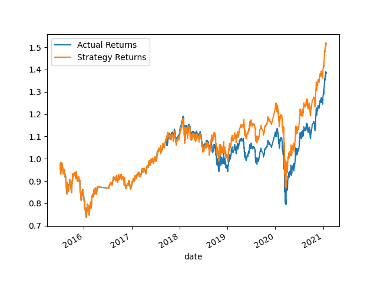
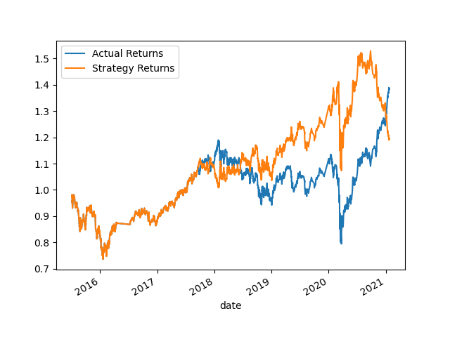
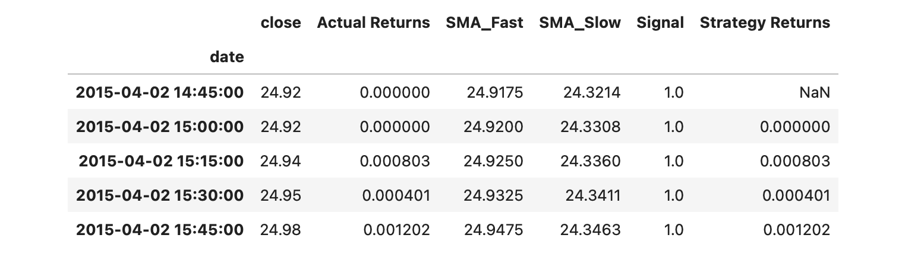
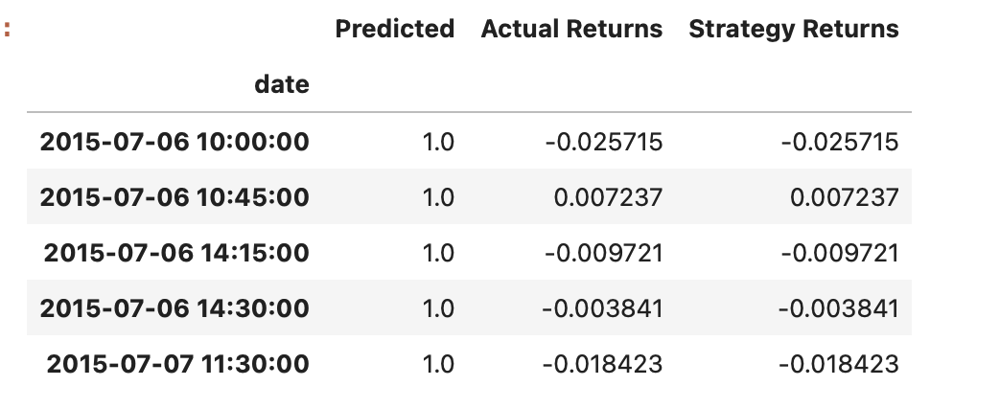

# Machine-Learning-Trading-Bot

1.Choose the set of parameters that best improved the trading algorithm returns. Save a PNG image of the cumulative product of the actual returns vs. the strategy returns, and document your conclusion in your README.md file.

* The Strategy returns seem to be more at a peak from 2019 to 2021. The algorithm in the Logistic regression model seem to be at 1.5 for a longer period of time rather than the original model provided. The logReg model can adapt, buy and sell data efficiently. 

Original Model returns

Logistic Regression Model

2.Did this new model perform better or worse than the provided baseline model? Did this new model perform better or worse than your tuned trading algorithm?

*The SVM model seems to have better accuracy than the LOGREG model that I created. Comparing the two, the SVM model has an accuracy score of 0.55 whereas, the logiscic regression model has an accuracy score of 0.52. The acurracy is slightly less than the original data report, but by adjusting the data it might trigger different accuracy scores. 

SVM  Results
         precision    recall  f1-score   support

        -1.0       0.43      0.04      0.07      1804
         1.0       0.56      0.96      0.71      2288

    accuracy                           0.55      4092

LogReg Results
             precision    recall  f1-score   support

        -1.0       0.44      0.32      0.37      1804
         1.0       0.56      0.68      0.61      2288

    accuracy                           0.52      4092

3. In the previous sections, you updated your README.md file with your conclusions. To accomplish this section, you need to add a summary evaluation report at the end of the README.md file. For this report, express your final conclusions and analysis. Support your findings by using the PNG images that you created.

* The trading algorithms are both well and efficient. I have used the Logistic regression library to help me improve the data. My findings were that the SVM model has a higher accuracy rate rather than the logistic regression model that I created. In the other hand, My Logreg model works better with the data and has a slighly higher outcome than the original. 

 
